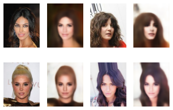
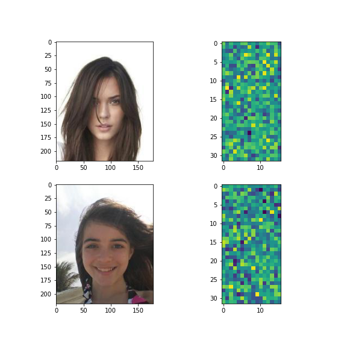
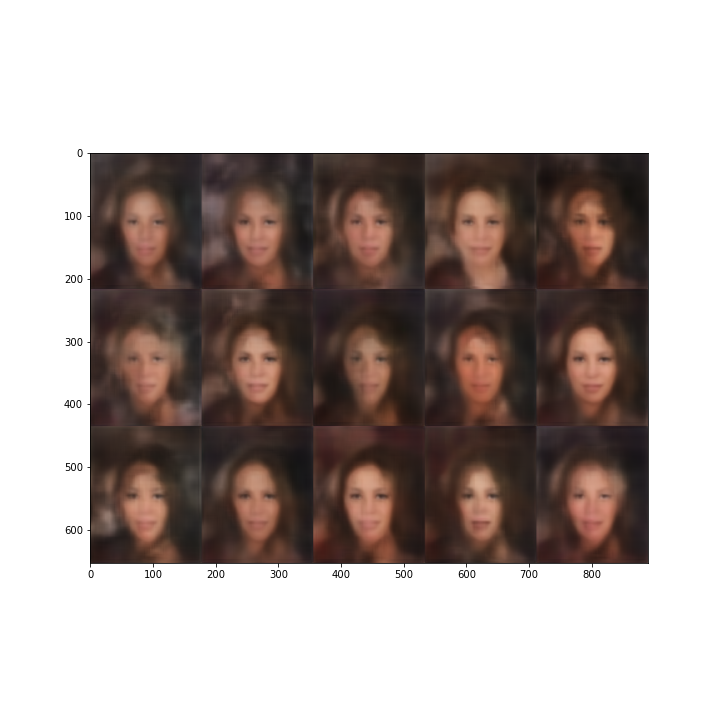
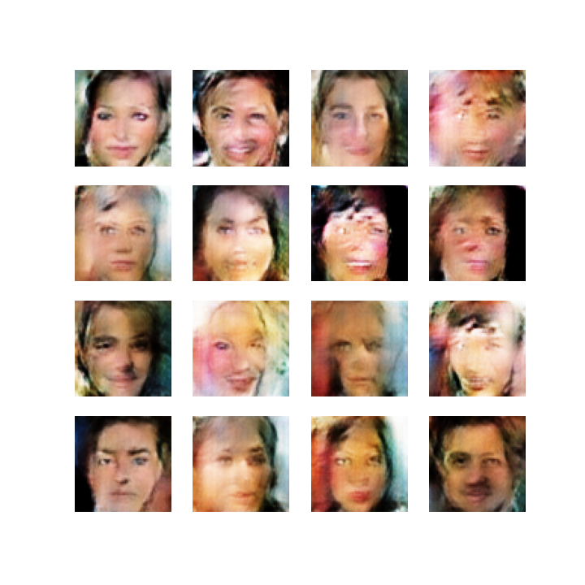
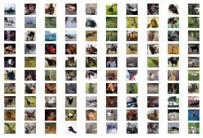
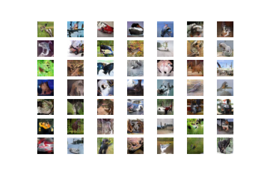

# Computer-Vision

### Projects:

- Celebrity Autoencoder.

  Reconstructed Images:
  
  

  Latent space Visualization:
  
  
  
  Faces generated from just noise:
  
  
  

- Fake Faces (CelebA)

  Generated Faces (Results would be better over more epochs):
  
  
  
  How it changed overtime:
  
  

  
- Fake Image Generation, Cifar 10 (DCGANS)

  Original Dataset, for comparison: 
  
  
  
  Fake Images Created:
  
   
